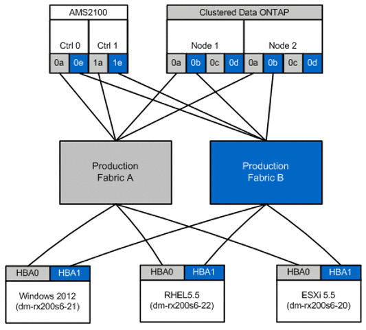

= 建立主機對目的地區域
:allow-uri-read: 
:icons: font
:imagesdir: ../media/

[role="lead"]
您需要建立主機對目的地區域。有兩種類型的正式作業架構：Fabric A和Fabric B

以下是主機與目的地儲存分區的圖例。

正式作業區域可在正式作業架構中使用A.

[cols="3*"]
|===
| 區域 | WWPN | 區域成員 

 a| 
區域：rx21_flicDOT
 a| 
21：00：00：24：ff：30：14：c5

20：01：00：A0：98：2f：94：D1

20：03：00：A0：98：2f：94：D1
 a| 
RX21 HBA 0

FlicDOT lif1.

FlicDOT lif3.

 a| 
區域：rx22_flicDOT
 a| 
21：00：00：24：ff：30：04：85

20：01：00：A0：98：2f：94：D1

20：03：00：A0：98：2f：94：D1
 a| 
RX22 HBA 0

FlicDOT lif1.

FlicDOT lif3.

 a| 
區域：rx20_flicDOT
 a| 
21：00：00：24：ff：30：03：ea

20：01：00：A0：98：2f：94：D1

20：03：00：A0：98：2f：94：D1
 a| 
RX20 HBA 0

FlicDOT lif1.

FlicDOT lif3.

|===
正式作業區域可在正式作業架構B中使用

[cols="3*"]
|===
| 區域 | WWPN | 區域成員 

 a| 
區域：rx21_flicDOT
 a| 
21：00：00：24：ff：30：14：c4

20：02：00：A0：98：2f：94：D1

20：04：00：A0：98：2f：94：D1
 a| 
RX21 HBA 1

FlicDOT lif2.

FlicDOT lif4.

 a| 
區域：rx22_flicDOT
 a| 
21：00：00：24：ff：30：04：84

20：02：00：A0：98：2f：94：D1

20：04：00：A0：98：2f：94：D1
 a| 
RX22 HBA 1

FlicDOT lif2.

FlicDOT lif4.

 a| 
區域：rx20_flicDOT
 a| 
21：00：00：24：ff：30：03：EB

20：02：00：A0：98：2f：94：D1

20：04：00：A0：98：2f：94：D1
 a| 
RX20 HBA 1

FlicDOT lif2.

FlicDOT lif4.

|===