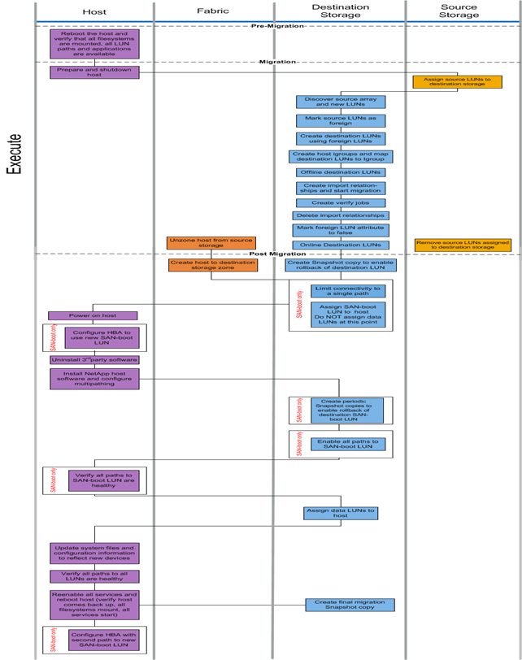

= 離線移轉工作流程
:allow-uri-read: 
:icons: font
:imagesdir: ../media/

[role="lead"]
離線移轉工作流程會在移轉程序的執行階段執行。離線工作流程圖顯示在主機、架構、目的地儲存設備和來源儲存設備上執行的工作。

下表列出離線工作流程工作。

[cols="2*"]
|===
| 元件 | 工作 

 a| 
主機
 a| 
. 重新啟動主機、並確認所有檔案系統均已掛載、所有LUN路徑均可用、且服務已啟動。
. 準備並關閉主機。
. 移轉完成後、請開啟主機電源。
. 將HBA設定為使用新的SAN開機LUN（僅限SAN開機）。
. 解除安裝協力廠商MPIO。
. 安裝NetApp主機軟體並設定多重路徑。
. 驗證SAN開機LUN的所有路徑是否正常（僅適用於SAN開機）。
. 更新系統檔案和組態以反映新裝置。
. 驗證所有LUN的所有路徑是否正常。
. 重新啟用所有服務並重新開機主機（確認主機已備份、所有檔案系統均已掛載、所有服務均已啟動）。
. 使用第二個路徑設定HBA、以存取新的SAN開機LUN（僅限SAN開機）。

 a| 
網路
 a| 
. 從來源儲存設備取消主機的分區。
. 建立主機對目的地儲存區域。

 a| 
目的地儲存設備
 a| 
. 探索來源陣列和新LUN。
. 將來源LUN標示為外部。
. 使用外部LUN建立目的地LUN。
. 建立主機啟動器igroup並將目的地LUN對應至igroup.移 轉Snapshot複本。
. 離線目的地LUN。
. 建立匯入關係並開始匯入工作。
. 建立驗證工作（選用）。
. 刪除匯入關係。
. 將Foreign LUN（外部LUN）屬性標記為假。
. 線上目的地LUN。
. 建立Snapshot®複本、以便復原目的地LUN。
. 限制單一路徑的連線（僅限SAN開機）。
. 將SAN開機LUN指派給主機；此時請勿指派資料LUN（僅限SAN開機）。
. 確認所有主機連接埠均已登入。
. 建立週期性Snapshot複本、以便復原目的地SAN開機LUN（僅限SAN開機）。
. 啟用SAN開機LUN的所有路徑（僅SAN開機）。
. 將資料LUN指派給主機。
. 建立最終Snapshot複本。

 a| 
來源儲存設備
 a| 
. 將來源LUN指派給目的地儲存設備。
. 移除指派給目的地儲存設備的來源LUN。

|===