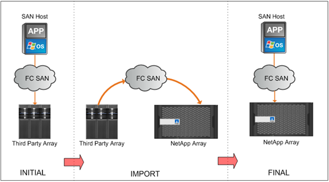
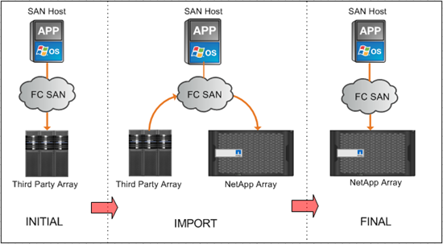

= 外部LUN匯入總覽
:allow-uri-read: 
:icons: font
:imagesdir: ../media/

[role="lead"]
Foreign LUN Import（FLI）功能內建ONTAP 於此功能中、可讓使用者以簡單且有效率的方式、將資料從外部陣列LUN匯入NetApp LUN。

所有FLI移轉作業均在LUN層級運作。FLI是嚴格的區塊型工具、不支援檔案、記錄、NFS及CIFS型移轉。如需檔案層級傳輸協定（例如NFS和CIFS/SMB）的其他移轉方法討論、請參閱_資料移轉工具快速參考指南_。

FLI運用NetApp FlexArray ®解決方案來探索外部RAID陣列LUN、並從中提取資料。支援NetApp的支援功能、可在一或多個第三方陣列前做為啟動器。FlexArray ONTAP可將這些陣列中的LUN掛載為後端儲存設備、然後將這些LUN中的空間呈現為NetApp統一化儲存設備（允許FCP、FCoE、iSCSI、NFS及CIFS/SMB傳輸協定存取）、以供SAN或NAS環境中的主機使用。FlexArray

FLI不需要FlexArray 使用不必要的授權。FLI運用FlexArray VMware技術將外部LUN複製到NetApp ONTAP 的支援陣列、然後讓使用該LUN的主機和應用程式指向目前裝載該LUN的NetApp陣列。雖然不再需要專業服務執行的移轉作業、但NetApp強烈建議專業服務參與範圍、規劃及訓練、以協助所有移轉作業（最簡單的移轉作業）ONTAP 。

FLI的開發目的是將SAN LUN移轉至ONTAPFLI支援多種移轉需求、包括但不限於下列項目：

* 根據支援的功能、將資料從EMC、Hitachi、HP及其他廠商移轉至NetApp。FlexArray
* 在資料中心重新配置、整合及更換陣列期間、簡化並加速區塊資料移轉。
* 將移轉和LUN重新配置整合至單一工作流程。

此外、7-Mode to ONTAP VMware移轉程序可將32位元集合體轉換為64位元集合體、修正對齊問題、並將LUN移轉為單一作業。

FLI可讓NetApp儲存設備探索要匯入以進行資料移轉的LUN。外部LUN會在NetApp儲存設備上顯示為磁碟、而且不會自動指派任何擁有權、因此不會誤覆使用者資料。包含外部陣列LUN的磁碟必須標示為Foreign（外部）。必須嚴格遵守外部陣列LUN的設定規則、才能將FLI用於NetApp儲存設備。請參閱主題： xref:concept_lun_requirements_and_limitations.adoc[LUN需求與限制]。

FLI在每個控制器上至少需要一個實體FC連接埠、並以啟動器模式直接移轉LUN。建議使用兩個連接埠（每個光纖各一個）、但可以使用單一連接埠。這些連接埠用於連接來源陣列、需要分區和遮罩、才能查看和掛載來源LUN。如果您需要將連接埠從目標變更為啟動器、請參閱《_ FlexArray 》《虛擬化安裝要求與參考指南》_、以瞭解將FC連接埠從目標轉換為啟動器的程序。

FLI移轉作業可以離線執行、這會在匯入期間中斷營運、或是在線上執行、這主要是不中斷營運的。

此圖顯示FLI離線資料移轉、讓主機離線進行移轉。NetApp陣列會直接從協力廠商陣列複製資料。

此圖顯示FLI線上資料移轉。主機連接至NetApp控制器、新LUN現在位於該控制器的主控位置。然後、主機作業可在匯入期間繼續執行。

*相關資訊*

https://library.netapp.com/ecm/ecm_get_file/ECMP12363719["資料移轉工具快速參考指南"]

https://docs.netapp.com/us-en/ontap-flexarray/install/index.html["介紹虛擬化安裝需求與參考資料FlexArray"]
