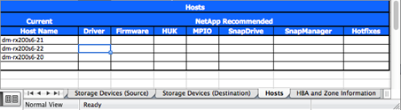

= 落差分析報告
:allow-uri-read: 
:icons: font
:imagesdir: ../media/

[role="lead"]
落差分析是客戶目前與NetApp建議環境的報告。它會針對移轉後所需的客戶環境、提供所有建議的升級。

目標組態（移轉後）包含每個主機的詳細資料（OS組態、MPIO、HBA詳細資料、主機公用程式套件版本等）。如SnapDrive 需其他NetApp所需產品的相關資訊、例如：功能表和SnapManager 功能表。

由於通常需要排程維護時間、因此在實際移轉事件發生之前、通常不會進行必要的變更。一般而言、在移轉之前對MPIO組態所做的任何變更、也會影響目前儲存設備的支援。

「站台調查與規劃」工作表的「主機」區段中、完整的NetApp建議區段將做為落差分析報告。必須針對移轉專案所包含的每個主機完成落差分析。完成的落差分析報告必須與客戶一起審查。

以下是差距分析報告範例。

