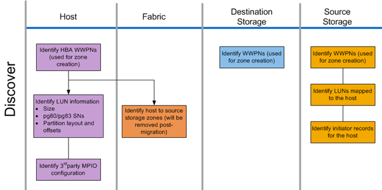

= 探索階段工作流程
:allow-uri-read: 
:icons: font
:imagesdir: ../media/

[role="lead"]
移轉程序的「探索」階段著重於收集用於主機補救的資訊、並在後續步驟中建立移轉計畫。大部分資訊的收集都是使用OneCollect 資料收集工具（例如：）來自動化。

下圖顯示「探索」階段工作流程。

下表列出探索階段工作。

[cols="2*"]
|===
| 元件 | 工作 

 a| 
主機
 a| 
. 識別HBA WWPN（用於區域建立）。
. 識別LUN資訊（大小、序號、分割區配置和偏移）。
. 識別第三方MPIO組態、主機作業系統、HB/CNA機型和韌體等。

 a| 
網路
 a| 
識別主機對來源儲存區域。（移轉後移除）。

 a| 
目的地儲存設備
 a| 
識別將用於啟動器/目標使用量之連接埠的WWPN。

 a| 
來源儲存設備
 a| 
. 識別WWPN（用於區域建立）。
. 識別對應至主機的LUN。
. 識別主機的啟動器記錄。

|===