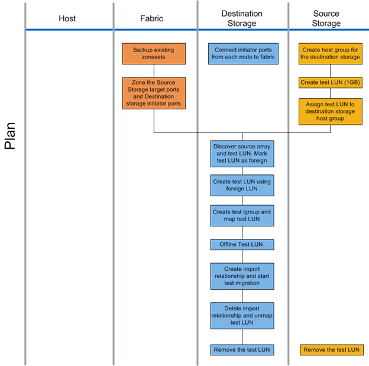

= 規劃階段工作流程
:allow-uri-read: 
:icons: font
:imagesdir: ../media/

[role="lead"]
資料移轉程序的規劃階段著重於建立詳細移轉計畫所需的工作、並確保所有工作都已準備好進行實際移轉。大部分的移轉工作都是在此階段執行的規劃。

規劃階段是使用分析階段收集的主機落差分析資訊來擬定補救計畫。規劃時請使用主機補救資訊。驗證端點對端點連線後、會執行測試移轉、以確保在開始正式作業移轉之前、所有項目都已正確設定。

下圖顯示計畫工作流程。

下表列出規劃階段工作。

[cols="2*"]
|===
| 元件 | 工作 

 a| 
網路
 a| 
. 備份現有的區域集。
. 將來源儲存設備分區至目的地儲存設備。

 a| 
目的地儲存設備
 a| 
. 將啟動器連接埠連接至Fabric。
. 探索來源儲存設備並測試LUN。將來源LUN標示為外部LUN。
. 使用外部LUN建立測試LUN。
. 建立測試igroup和對應測試LUN。
. 離線測試LUN。
. 建立匯入關係並開始測試移轉。
. 刪除匯入關係並取消對應測試LUN。
. 移除測試LUN。

 a| 
來源儲存設備
 a| 
. 使用啟動器連接埠WWPN建立目的地儲存設備的主機群組。
. 建立測試LUN（1GB）。
. 將（對應/遮罩）測試LUN指派給目的地儲存主機群組。
. 移除測試LUN。

|===