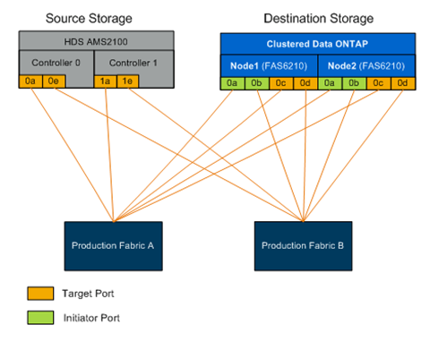

= FLI的實體配線需求
:allow-uri-read: 
:icons: font
:imagesdir: ../media/

[role="lead"]
移轉期間所使用的儲存陣列、必須具有兩個Fabric中每個控制器（使用中）的主要路徑。這表示要移轉的來源陣列和目的地陣列節點必須位於兩個Fabric的通用區域中。不需要在NetApp叢集中新增其他控制器、只有實際匯入/移轉LUN的控制器。雖然您可以使用間接路徑進行移轉、但最佳實務做法是在來源陣列和目的地陣列之間使用主動/最佳化路徑。下圖顯示HDS AMS2100與NetApp ONTAP 支援儲存設備的主要（作用中）路徑同時存在於兩種架構中。

此圖為雙Fabric的儲存線路範例。

請遵循以下佈線最佳實務做法：

* 不需使用任何啟動器連接埠、即可連接至Fabric。ONTAP如果可用連接埠不存在、請設定啟動器連接埠。

