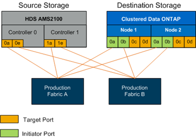

= 設定交換器區域
:allow-uri-read: 
:icons: font
:imagesdir: ../media/

[role="lead"]
您必須在SAN交換器上建立必要的區域、才能將來源儲存設備連接至目的地儲存設備。

.步驟
. 備份正式作業和移轉架構中每個交換器上的現有區域集。
. 將來源儲存設備和目的地儲存設備分區、如下所示。
+

. 建立區域、並將其新增至正式作業Fabric A的區域集
+
以下是正式作業區域的範例：適用於區域的正式作業架構A _AMS2100 _cDOT_Initiator、fabA。

+
|===
| WWPN | 區域成員 

 a| 
 50:06:0e:80:10:46:b9:60 a| 
 AMS2100 Ctrl 0 Port 0a

 a| 
 50:06:0e:80:10:46:b9:68 a| 
 AMS2100 Ctrl 1 Port 1a

 a| 
 50:0a:09:80:00:d3:51:59 a| 
 ONTAP Node 1 Port 0a

 a| 
 50:0a:09:80:00:e7:81:04 a| 
 ONTAP Node 2 Port 0a
|===
. 在Fabric A中啟動區域集
. 建立區域、並將其新增至正式作業架構B的區域集
+
以下是正式作業區域的範例：適用於區域的正式作業架構A _AMS2100 _cDOT_Initiator、fabB。

+
|===
| WWPN | 區域成員 

 a| 
 50:06:0e:80:10:46:b9:64 a| 
 AMS2100 Ctrl 0 Port 0e

 a| 
 50:06:0e:80:10:46:b9:6c a| 
 AMS2100 Ctrl 1 Port 1e

 a| 
 50:0a:09:80:00:d3:51:59 a| 
 ONTAP Node 1 Port 0b

 a| 
 50:0a:09:80:00:e7:81:04 a| 
 ONTAP Node 2 Port 0b
|===
. 在正式作業架構B中啟動區域網路

