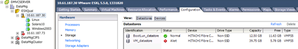
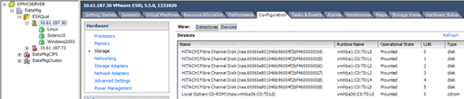

= ESXi主機的多重路徑驗證
:allow-uri-read: 
:icons: font
:imagesdir: ../media/

[role="lead"]
在「Foreign LUN Import（FLI）（外部LUN匯入（FLI）））」程序中、您應該確認主機上的多重路徑已設定且正常運作。

針對ESXi主機完成下列步驟。

.步驟
. 使用VMware vSphere Client判斷ESXi和虛擬機器。
+

. 使用vSphere Client判斷要移轉的SAN LUN。
+

. 確定要移轉的VMFS和RDM（vfat）磁碟區：「esxcli儲存檔案系統清單」
+
[listing]
----
Mount Point                                        Volume Name        UUID                                 Mounted  Type           Size         Free
-------------------------------------------------  -----------------  -----------------------------------  -------  ------  -----------  -----------
/vmfs/volumes/538400f6-3486df59-52e5-00262d04d700  BootLun_datastore  538400f6-3486df59-52e5-00262d04d700     true  VMFS-5  13421772800  12486443008
/vmfs/volumes/53843dea-5449e4f7-88e0-00262d04d700  VM_datastore       53843dea-5449e4f7-88e0-00262d04d700     true  VMFS-5  42681237504   6208618496
/vmfs/volumes/538400f6-781de9f7-c321-00262d04d700                     538400f6-781de9f7-c321-00262d04d700     true  vfat     4293591040   4269670400
/vmfs/volumes/c49aad7f-afbab687-b54e-065116d72e55                     c49aad7f-afbab687-b54e-065116d72e55     true  vfat      261853184     77844480
/vmfs/volumes/270b9371-8fbedc2b-1f3b-47293e2ce0da                     270b9371-8fbedc2b-1f3b-47293e2ce0da     true  vfat      261853184    261844992
/vmfs/volumes/538400ef-647023fa-edef-00262d04d700                     538400ef-647023fa-edef-00262d04d700     true  vfat      299712512     99147776
~ #
----
+
[NOTE]
====
如果VMFS具有extends（跨距VMFS）、則應移轉屬於跨距的所有LUN。若要顯示GUI中的所有擴充功能、請移至「組態」->「硬體」->「儲存設備」、然後按一下「資料存放區」以選取「內容」連結。

====
+
[NOTE]
====
移轉後、將其新增回儲存設備時、您會看到多個具有相同VMFS標籤的LUN項目。在此案例中、您應要求客戶僅選取標示為標頭的項目。

====
. 確定要移轉的LUN和大小：「esxcfg-scsidevs -c」
+
[listing]
----
Device UID                            Device Type      Console Device                                            Size      Multipath PluginDisplay Name
mpx.vmhba36:C0:T0:L0                  CD-ROM           /vmfs/devices/cdrom/mpx.vmhba36:C0:T0:L0                  0MB       NMP     Local Optiarc CD-ROM (mpx.vmhba36:C0:T0:L0)
naa.60060e801046b96004f2bf4600000014  Direct-Access    /vmfs/devices/disks/naa.60060e801046b96004f2bf4600000014  20480MB   NMP     HITACHI Fibre Channel Disk (naa.60060e801046b96004f2bf4600000014)
naa.60060e801046b96004f2bf4600000015  Direct-Access    /vmfs/devices/disks/naa.60060e801046b96004f2bf4600000015  40960MB   NMP     HITACHI Fibre Channel Disk (naa.60060e801046b96004f2bf4600000015)
~~~~~~ Output truncated ~~~~~~~
~ #
----
. 識別要移轉的原始裝置對應（RDM）LUN。
. 尋找RDM裝置：「+尋找/vmfs/volumes -name **-rdm**+」
+
[listing]
----
/vmfs/volumes/53843dea-5449e4f7-88e0-00262d04d700/Windows2003/Windows2003_1-rdmp.vmdk
/vmfs/volumes/53843dea-5449e4f7-88e0-00262d04d700/Windows2003/Windows2003_2-rdm.vmdk
/vmfs/volumes/53843dea-5449e4f7-88e0-00262d04d700/Linux/Linux_1-rdm.vmdk
/vmfs/volumes/53843dea-5449e4f7-88e0-00262d04d700/Solaris10/Solaris10_1-rdmp.vmdk
----
. 從先前的輸出中移除-rdmp和-RDM、然後執行vmkfsools命令來尋找VML對應和RDM類型。
+
[listing]
----
# vmkfstools -q /vmfs/volumes/53843dea-5449e4f7-88e0-00262d04d700/Windows2003/Windows2003_1.vmdk
vmkfstools -q /vmfs/volumes/53843dea-5449e4f7-88e0-00262d04d700/Windows2003/Windows2003_1.vmdk
Disk /vmfs/volumes/53843dea-5449e4f7-88e0-00262d04d700/Windows2003/Windows2003_1.vmdk is a Passthrough Raw Device Mapping
Maps to: vml.020002000060060e801046b96004f2bf4600000016444636303046
~ # vmkfstools -q /vmfs/volumes/53843dea-5449e4f7-88e0-00262d04d700/Windows2003/Windows2003_2.vmdk
Disk /vmfs/volumes/53843dea-5449e4f7-88e0-00262d04d700/Windows2003/Windows2003_2.vmdk is a Non-passthrough Raw Device Mapping
Maps to: vml.020003000060060e801046b96004f2bf4600000017444636303046
~ # vmkfstools -q /vmfs/volumes/53843dea-5449e4f7-88e0-00262d04d700/Linux/Linux_1.vmdk
Disk /vmfs/volumes/53843dea-5449e4f7-88e0-00262d04d700/Linux/Linux_1.vmdk is a Non-passthrough Raw Device Mapping
Maps to: vml.020005000060060e801046b96004f2bf4600000019444636303046
~ # vmkfstools -q /vmfs/volumes/53843dea-5449e4f7-88e0-00262d04d700/Solaris10/Solaris10_1.vmdk
Disk /vmfs/volumes/53843dea-5449e4f7-88e0-00262d04d700/Solaris10/Solaris10_1.vmdk is a Passthrough Raw Device Mapping
Maps to: vml.020004000060060e801046b96004f2bf4600000018444636303046
~ #
----
+
[NOTE]
====
PassthThrough為RDM、實體為（RDMP）、而非PassthThrough則為RDM、虛擬為（RDMV\）。虛擬RDM和VM Snapshot複本的VM會在移轉後中斷、因為VM Snapshot delta vmDK指向具有過時naa ID的RDM。因此在移轉之前、請客戶移除此類VM中的所有Snapshot複本。在VM上按一下滑鼠右鍵、然後按一下Snapshot（快照）-> Snapshot Manager Delete All（全部刪除）按鈕。請參閱NetApp知識庫3013935、以瞭解有關NetApp儲存設備上VMware硬體加速鎖定的詳細資訊。

====
. 識別LUN naa與RDM裝置對應。
+
[listing]
----
~ # esxcfg-scsidevs -u | grep vml.020002000060060e801046b96004f2bf4600000016444636303046
naa.60060e801046b96004f2bf4600000016                            vml.020002000060060e801046b96004f2bf4600000016444636303046
~ # esxcfg-scsidevs -u | grep vml.020003000060060e801046b96004f2bf4600000017444636303046
naa.60060e801046b96004f2bf4600000017                            vml.020003000060060e801046b96004f2bf4600000017444636303046
~ # esxcfg-scsidevs -u | grep vml.020005000060060e801046b96004f2bf4600000019444636303046
naa.60060e801046b96004f2bf4600000019                            vml.020005000060060e801046b96004f2bf4600000019444636303046
~ # esxcfg-scsidevs -u | grep vml.020004000060060e801046b96004f2bf4600000018444636303046
naa.60060e801046b96004f2bf4600000018                            vml.020004000060060e801046b96004f2bf4600000018444636303046
~ #
----
. 確定虛擬機器組態：「esxcli儲存檔案系統清單| grep VMFS」
+
[listing]
----
/vmfs/volumes/538400f6-3486df59-52e5-00262d04d700  BootLun_datastore  538400f6-3486df59-52e5-00262d04d700     true  VMFS-5  13421772800  12486443008
/vmfs/volumes/53843dea-5449e4f7-88e0-00262d04d700  VM_datastore       53843dea-5449e4f7-88e0-00262d04d700     true  VMFS-5  42681237504   6208618496
~ #
----
. 記錄資料存放區的UUID。
. 複製「/etc/vmware/hostd/vmInventory．xml」、並記下檔案和vmx組態路徑的內容。
+
[listing]
----
~ # cp /etc/vmware/hostd/vmInventory.xml /etc/vmware/hostd/vmInventory.xml.bef_mig
~ # cat /etc/vmware/hostd/vmInventory.xml
<ConfigRoot>
  <ConfigEntry id="0001">
    <objID>2</objID>
    <vmxCfgPath>/vmfs/volumes/53843dea-5449e4f7-88e0-00262d04d700/Windows2003/Windows2003.vmx</vmxCfgPath>
  </ConfigEntry>
  <ConfigEntry id="0004">
    <objID>5</objID>
    <vmxCfgPath>/vmfs/volumes/53843dea-5449e4f7-88e0-00262d04d700/Linux/Linux.vmx</vmxCfgPath>
  </ConfigEntry>
  <ConfigEntry id="0005">
    <objID>6</objID>
    <vmxCfgPath>/vmfs/volumes/53843dea-5449e4f7-88e0-00262d04d700/Solaris10/Solaris10.vmx</vmxCfgPath>
  </ConfigEntry>
</ConfigRoot>
----
. 識別虛擬機器硬碟。
+
移轉後必須提供此資訊、才能依序新增移除的RDM裝置。

+
[listing]
----
~ # grep fileName /vmfs/volumes/53843dea-5449e4f7-88e0-00262d04d700/Windows2003/Windows2003.vmx
scsi0:0.fileName = "Windows2003.vmdk"
scsi0:1.fileName = "Windows2003_1.vmdk"
scsi0:2.fileName = "Windows2003_2.vmdk"
~ # grep fileName /vmfs/volumes/53843dea-5449e4f7-88e0-00262d04d700/Linux/Linux.vmx
scsi0:0.fileName = "Linux.vmdk"
scsi0:1.fileName = "Linux_1.vmdk"
~ # grep fileName /vmfs/volumes/53843dea-5449e4f7-88e0-00262d04d700/Solaris10/Solaris10.vmx
scsi0:0.fileName = "Solaris10.vmdk"
scsi0:1.fileName = "Solaris10_1.vmdk"
~ #
----
. 判斷RDM裝置、虛擬機器對應及相容模式。
. 使用上述資訊、記下RDM對應至裝置、虛擬機器、相容模式和順序。
+
稍後將RDM裝置新增至VM時、您將需要此資訊。

+
[listing]
----
Virtual Machine -> Hardware -> NAA -> Compatibility mode
Windows2003 VM -> scsi0:1.fileName = "Windows2003_1.vmdk" -> naa.60060e801046b96004f2bf4600000016
-> RDM Physical
Windows2003 VM -> scsi0:2.fileName = "Windows2003_2.vmdk" -> naa.60060e801046b96004f2bf4600000017
-> RDM Virtual
Linux VM -> scsi0:1.fileName = “Linux_1.vmdk” -> naa.60060e801046b96004f2bf4600000019 -> RDM Virtual
Solaris10 VM -> scsi0:1.fileName = “Solaris10_1.vmdk” -> naa.60060e801046b96004f2bf4600000018 -> RDM Physical
----
. 確定多重路徑組態。
. 在vSphere Client中取得儲存設備的多重路徑設定：
+
.. 在vSphere Client中選取ESX或ESXi主機、然後按一下「組態」索引標籤。
.. 按一下「*儲存設備*」。
.. 選取資料存放區或對應的LUN。
.. 按一下*「內容」*。
.. 在「內容」對話方塊中、視需要選取所需的範圍。
.. 按一下*「Extent Device」（範圍裝置）>*「Manage Paths」（管理路徑）*、然後在「Manage Path」（管理路徑）對話方塊中取得路徑
+
image::../media/esxi_host_3.png[vSphere儲存設備路徑]

. 從ESXi主機命令列取得LUN多重路徑資訊：
+
.. 登入ESXi主機主控台。
.. 執行esxcli儲存設備NMP裝置清單以取得多重路徑資訊。
+
[listing]
----
# esxcli storage nmp device list
naa.60060e801046b96004f2bf4600000014
   Device Display Name: HITACHI Fibre Channel Disk (naa.60060e801046b96004f2bf4600000014)
   Storage Array Type: VMW_SATP_DEFAULT_AA
   Storage Array Type Device Config: SATP VMW_SATP_DEFAULT_AA does not support device configuration.
   Path Selection Policy: VMW_PSP_RR
   Path Selection Policy Device Config: {policy=rr,iops=1000,bytes=10485760,useANO=0; lastPathIndex=3: NumIOsPending=0,numBytesPending=0}
   Path Selection Policy Device Custom Config:
   Working Paths: vmhba2:C0:T1:L0, vmhba2:C0:T0:L0, vmhba1:C0:T1:L0, vmhba1:C0:T0:L0
   Is Local SAS Device: false
   Is Boot USB Device: false

naa.60060e801046b96004f2bf4600000015
   Device Display Name: HITACHI Fibre Channel Disk (naa.60060e801046b96004f2bf4600000015)
   Storage Array Type: VMW_SATP_DEFAULT_AA
   Storage Array Type Device Config: SATP VMW_SATP_DEFAULT_AA does not support device configuration.
   Path Selection Policy: VMW_PSP_RR
   Path Selection Policy Device Config: {policy=rr,iops=1000,bytes=10485760,useANO=0; lastPathIndex=0: NumIOsPending=0,numBytesPending=0}
   Path Selection Policy Device Custom Config:
   Working Paths: vmhba2:C0:T1:L1, vmhba2:C0:T0:L1, vmhba1:C0:T1:L1, vmhba1:C0:T0:L1
   Is Local SAS Device: false
   Is Boot USB Device: false

naa.60060e801046b96004f2bf4600000016
   Device Display Name: HITACHI Fibre Channel Disk (naa.60060e801046b96004f2bf4600000016)
   Storage Array Type: VMW_SATP_DEFAULT_AA
   Storage Array Type Device Config: SATP VMW_SATP_DEFAULT_AA does not support device configuration.
   Path Selection Policy: VMW_PSP_RR
   Path Selection Policy Device Config: {policy=rr,iops=1000,bytes=10485760,useANO=0; lastPathIndex=1: NumIOsPending=0,numBytesPending=0}
   Path Selection Policy Device Custom Config:
   Working Paths: vmhba2:C0:T1:L2, vmhba2:C0:T0:L2, vmhba1:C0:T1:L2, vmhba1:C0:T0:L2
   Is Local SAS Device: false
   Is Boot USB Device: false

naa.60060e801046b96004f2bf4600000017
   Device Display Name: HITACHI Fibre Channel Disk (naa.60060e801046b96004f2bf4600000017)
   Storage Array Type: VMW_SATP_DEFAULT_AA
   Storage Array Type Device Config: SATP VMW_SATP_DEFAULT_AA does not support device configuration.
   Path Selection Policy: VMW_PSP_RR
   Path Selection Policy Device Config: {policy=rr,iops=1000,bytes=10485760,useANO=0; lastPathIndex=1: NumIOsPending=0,numBytesPending=0}
   Path Selection Policy Device Custom Config:
   Working Paths: vmhba2:C0:T1:L3, vmhba2:C0:T0:L3, vmhba1:C0:T1:L3, vmhba1:C0:T0:L3
   Is Local SAS Device: false
   Is Boot USB Device: false

naa.60060e801046b96004f2bf4600000018
   Device Display Name: HITACHI Fibre Channel Disk (naa.60060e801046b96004f2bf4600000018)
   Storage Array Type: VMW_SATP_DEFAULT_AA
   Storage Array Type Device Config: SATP VMW_SATP_DEFAULT_AA does not support device configuration.
   Path Selection Policy: VMW_PSP_RR
   Path Selection Policy Device Config: {policy=rr,iops=1000,bytes=10485760,useANO=0; lastPathIndex=1: NumIOsPending=0,numBytesPending=0}
   Path Selection Policy Device Custom Config:
   Working Paths: vmhba2:C0:T1:L4, vmhba2:C0:T0:L4, vmhba1:C0:T1:L4, vmhba1:C0:T0:L4
   Is Local SAS Device: false
   Is Boot USB Device: false

naa.60060e801046b96004f2bf4600000019
   Device Display Name: HITACHI Fibre Channel Disk (naa.60060e801046b96004f2bf4600000019)
   Storage Array Type: VMW_SATP_DEFAULT_AA
   Storage Array Type Device Config: SATP VMW_SATP_DEFAULT_AA does not support device configuration.
   Path Selection Policy: VMW_PSP_RR
   Path Selection Policy Device Config: {policy=rr,iops=1000,bytes=10485760,useANO=0; lastPathIndex=1: NumIOsPending=0,numBytesPending=0}
   Path Selection Policy Device Custom Config:
   Working Paths: vmhba2:C0:T1:L5, vmhba2:C0:T0:L5, vmhba1:C0:T1:L5, vmhba1:C0:T0:L5
   Is Local SAS Device: false
   Is Boot USB Device: false
----

