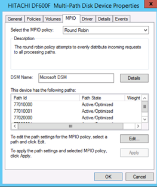

= Windows主機的多重路徑驗證
:allow-uri-read: 
:icons: font
:imagesdir: ../media/

[role="lead"]
在「Foreign LUN Import（FLI）（外部LUN匯入（FLI）））」程序中、您應該確認主機上的多重路徑已設定且正常運作。

針對Windows主機完成下列步驟。

.步驟
. 開放式磁碟管理：
+
.. 在Windows桌面上、按一下* Start*。
.. 在「Start Search（開始搜尋）」欄位中、輸入「diskmgmt.msc」。
.. 在「程式集」清單中、按一下「diskmgmt」。

. 在您要驗證多個路徑的每個磁碟上按一下滑鼠右鍵、然後按一下「*內容*」。
. 在MPIO索引標籤的Select the MPIO policy（選取MPIO原則）清單中、按一下所有作用中的路徑。
+

+
若要使用命令列驗證多重路徑、請完成下列步驟：

. 開啟Windows命令提示字元。
. 執行mpclaim.exe -v c：\multipathconfig.txt以擷取多重路徑組態。

