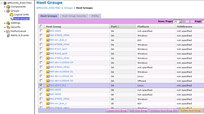
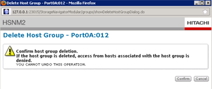

= 正在移除目的地陣列組態
:allow-uri-read: 
:icons: font
:imagesdir: ../media/

[role="lead"]
下列步驟說明如何在完成FLI移轉之後、從來源陣列移除目的地陣列組態。

.步驟
. 以系統的形式登入Hitachi Storage Navigator模組化。
. 選擇* AMS 2100* Array（* AMS 2100*陣列）、然後按一下* Show（顯示）*和* Configure Array*（*組
. 使用root登入。
. 展開群組並選取*主機群組*。
. 選取* cDOT_FLI*主機群組、然後按一下*刪除主機群組*。
+

. 確認刪除主機群組。
+

