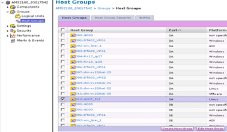
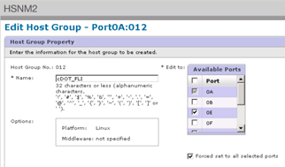
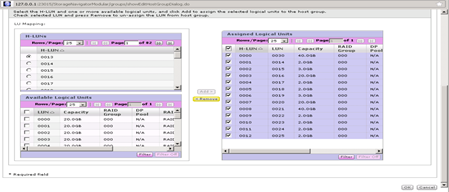

= 移除ONTAP 來源LUN的不穩定性儲存設備
:allow-uri-read: 
:icons: font
:imagesdir: ../media/

[role="lead"]
下列步驟說明如何ONTAP 在移轉完成後、從您的功能區移除來源LUN。

NOTE: 本工作使用範例中的_HDS AMS2100陣列。如果您使用不同的陣列或不同版本的陣列GUI、則工作可能會有所不同。

.步驟
. 登入Hitachi Storage Navigator模組化。
. 選取ONTAP 在計畫階段建立的支援主機群組、然後選取*編輯主機群組*。
+

. 選取*連接埠*並選取*強制設定*至所有選取的連接埠。
+

. 選取從指派的邏輯LUN移轉的主機LUN。使用來源LUN工作表中提及的每個主機的LUN名稱。在此處、選取Windows 2012、RHEL 5.10和ESXi 5.5主機的LUN、然後選取*移除*。
+

