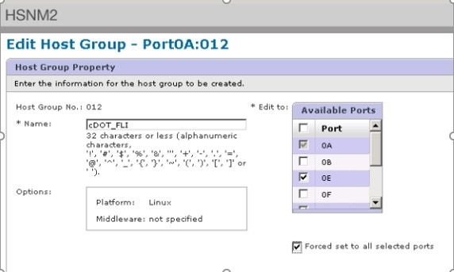

= 使用Hitachi AMS2100測試移轉範例
:allow-uri-read: 
:icons: font
:imagesdir: ../media/

[role="lead"]
以下是使用Hitachi AMS2100做為外部陣列的測試移轉範例。視所涉及的陣列、主機作業系統及其他變數而定、您的步驟可能有所不同。

您可以使用下列範例作為執行測試移轉所需步驟的一般指南。NetApp建議您儘早執行測試移轉、以便找出測試所帶來的任何問題、並有足夠的時間解決。在繼續正式作業移轉之前、應先在所有來源陣列和目的地陣列的組合上執行測試移轉。

若要執行測試移轉、請完成下列步驟：

.步驟
. 在來源陣列上建立2 GB測試LUN。
. 以系統的形式登入Hitachi Storage Navigator模組化。
. 選取AMS 2100陣列。
. 按一下*顯示及設定陣列*。
. 使用root登入。
. 展開*群組*並選取*邏輯單位*。
. 選擇* Create LU*（創建LU*）以創建測試LUN。
. 建立2 GB的測試LUN。
. 按一下「*確定*」。
. 跳過此處的LUN指派、然後按一下*關閉*繼續。
. 驗證是否已建立LUN 0026。
. 展開「**群組」並選取*「邏輯單位」*。
. 選取*主機群組*、將測試LUN對應至cDOT_FLI主機群組。
. 選擇在上一步中建立的主機群組cDOT_FLI、然後按一下*編輯主機群組*。
. 選擇主機群組的連接埠。在此範例中、我們選擇0A、0e、1a、1e。選取強制設定為所有選取的連接埠選項。
+

. 按一下「*邏輯單元*」、然後新增測試LUN LUN0026。
. 按一下「*確定*」以對應LUN。
. 選擇*是、我已閱讀上述警告並想要編輯主機群組*、然後按一下*確認*。
. 驗證主機群組建立、然後按一下*關閉*。
. 驗證測試LUN、並從來源儲存設備對應至目的地儲存設備、然後執行Foreign LUN Import（FLI）匯入。
. 使用管理員使用者透過SSH登入ONTAP 到這個功能區。
. 將模式變更為「進階」。「Data mig-cmode：：>設定-權限進階」
. 當系統詢問您是否要繼續執行進階命令時、請輸入y。
. 探索ONTAP 有關的來源陣列。等待幾分鐘、然後重試偵測來源陣列。「最小陣列顯示」
+
.. 第一次發現儲存陣列時ONTAP 、可能無法自動探索以顯示陣列。請依照下列指示、重設ONTAP 連接了交換器連接埠的交換器連接埠。
+
例如、DataMig-cmode叢集啟動器連接埠0A和0b of ONTAP the 0連接至Cisco連接埠4/9和4/11。若要重設Cisco交換器的連接埠4/9：

+
[listing]
----
conf t
interface fc4/9
shutdown
no shutdown
exit
exit
----
+
重設一個連接埠通常已足夠。重設一個連接埠後、請檢查陣列清單和LUN路徑。

. 驗證是否已透過所有啟動器連接埠探索來源陣列：「torage Array config show -array-name Hitachi DF600F_1」
+
[listing]
----

             LUN   LUN
Node         Group Count     Array Name       Array Target Port Initiator
------------ ----- ----- ---------------------------- -----------------------
DataMig-cmode-01 0     1    HITACHI_DF600F_1     50060e801046b960        0a
                                                 50060e801046b964        0b
                                                 50060e801046b968        0a
                                                 50060e801046b96c        0b
DataMig-cmode-02 0     1    HITACHI_DF600F_1     50060e801046b960        0a
                                                 50060e801046b964        0b
                                                 50060e801046b968        0a
                                                 50060e801046b96c        0b
----
. 列出從Hitachi儲存設備對應的測試LUN、並驗證磁碟內容和路徑：「torage disk show -array-name Hitachi DF600F_1 -instance」
+
[listing]
----

                  Disk: HIT-1.1
        Container Type: unassigned
            Owner/Home: -  / -
               DR Home: -
    Stack ID/Shelf/Bay: -  / -  / -
                   LUN: 0
                 Array: HITACHI_DF600F_1
                Vendor: HITACHI
                 Model: DF600F
         Serial Number: 83017542001A
                   UID: 48495441:43484920:38333031:37353432:30303236:00000000:00000000:00000000:00000000:00000000
                   BPS: 512
         Physical Size: -
              Position: present
Checksum Compatibility: block
             Aggregate: -
                  Plex: -
Paths:
                                LUN  Initiator Side        Target Side                                                        Link
Controller         Initiator     ID  Switch Port           Switch Port           Acc Use  Target Port                TPGN    Speed      I/O KB/s          IOPS
------------------ ---------  -----  --------------------  --------------------  --- ---  -----------------------  ------  -------  ------------  ------------
DataMig-cmode-01   0a             0  DM-Cisco9506-1:4-9    DM-Cisco9506-1:2-24   AO  INU  50060e801046b968              2   2 Gb/S             0             0
DataMig-cmode-01   0b             0  DM-Cisco9506-2:4-9    DM-Cisco9506-2:2-24   AO  INU  50060e801046b96c              2   2 Gb/S             0             0
DataMig-cmode-01   0b             0  DM-Cisco9506-2:4-9    DM-Cisco9506-2:1-14   AO  INU  50060e801046b964              1   2 Gb/S             0             0
DataMig-cmode-01   0a             0  DM-Cisco9506-1:4-9    DM-Cisco9506-1:1-14   AO  INU  50060e801046b960              1   2 Gb/S             0             0
DataMig-cmode-02   0a             0  DM-Cisco9506-1:4-11   DM-Cisco9506-1:2-24   AO  INU  50060e801046b968              2   2 Gb/S             0             0
DataMig-cmode-02   0b             0  DM-Cisco9506-2:4-11   DM-Cisco9506-2:2-24   AO  INU  50060e801046b96c              2   2 Gb/S             0             0
DataMig-cmode-02   0b             0  DM-Cisco9506-2:4-11   DM-Cisco9506-2:1-14   AO  INU  50060e801046b964              1   2 Gb/S             0             0
DataMig-cmode-02   0a             0  DM-Cisco9506-1:4-11   DM-Cisco9506-1:1-14   AO  INU  50060e801046b960              1   2 Gb/S             0             0

Errors:
-

DataMig-cmode::*>
----
. 使用序號「torage disk Set-Foreign」（磁碟集外部LUN）｛-Serial-Number 83017542001A｝-is -Foreign true（序列號83017542001A）、將來源LUN標記為外部LUN
. 確認來源LUN標示為Foreign（外部）：「torage disk show -array-name Hitachi DF600F_1」
. 列出所有外部陣列及其序號：「torage disk show -conter-type Foreign -Fields序號」
+
[NOTE]
====
LUN create命令會根據分割區偏移量來偵測大小和對齊方式、並據此以Foreign磁碟引數建立LUN。

====
. 建立目的地Volume：「vol create -vserver datamig flivol aggr1 -size 10g」
. 使用外部LUN建立測試LUN：「LUN create -vserver datamig -path /vol/flivol/testlun1 -osttype Linux -Foreign磁碟83017542001a'
. 列出測試LUN、並使用來源LUN「LUN show」驗證LUN的大小
+
[NOTE]
====
對於FLI離線移轉、LUN必須在線上、才能將其對應至igroup、然後必須離線才能建立LUN匯入關係。

====
. 建立傳輸協定FCP的測試igroup而不新增任何啟動器：「LUN igroup create -vserver datamig -igroup testg1 -protocol FCP -ostype Linux」
. 將測試LUN對應至測試igroup：「LUN map -vserver datamig -path /vol/flivol/testlun1 -igroup testg1」
. 離線測試LUN：「LUN離線-vserver datamig -path /vol/flivol/testlun1」
. 建立與測試LUN和外部LUN的匯入關係：「LUN匯入create -vserver datamig -path /vol/flivol/testlun1 -Foreign磁碟83017542001a'
. 開始移轉（匯入）：「LUN匯入start -vserver datamig -path /vol/flivol/testlun1」
. 監控匯入進度：「LUN匯入show -vserver datamig -path /vol/flivol/testlun1」
. 檢查匯入工作是否成功完成：「LUN匯入show -vserver datamig -path /vol/flivol/testlun1」
+
[listing]
----
vserver foreign-disk   path                operation admin operational percent
                                         in progress state state       complete
-------------------------------------------------------------------------------
datamig 83017542001A   /vol/flivol/testlun1
                                           import    started
                                                           completed        100
----
. 啟動驗證工作以比較來源和目的地LUN。監控驗證進度：「LUN匯入驗證start -vserver datamig -path /vol/flivol/testlun1」
+
[listing]
----
DataMig-cmode::*> lun import show -vserver datamig -path /vol/flivol/testlun1
vserver foreign-disk   path                operation admin operational percent
                                         in progress state state       complete
-------------------------------------------------------------------------------
datamig 83017542001A   /vol/flivol/testlun1
                                           verify    started
                                                           in_progress       44
----
. 檢查確認工作是否完成、且無任何錯誤：「LUN匯入show -vserver datamig -path /vol/flivol/testlun1」
+
[listing]
----
vserver foreign-disk   path                operation admin operational percent
                                         in progress state state       complete
-------------------------------------------------------------------------------
datamig 83017542001A   /vol/flivol/testlun1
                                           verify    started
                                                           completed        100
----
. 刪除匯入關係以移除移轉工作：「LUN匯入刪除-vserver datamig -path /vol/flivol/testlun1`LUN匯入show -vserver datamig -path /vol/flivol/testlun1'
. 從測試igroup中取消對應測試LUN：「LUN unmap -vserver datamig -path /vol/flivol/testlun1 -igroup testg1」
. 線上測試LUN：「LUN online -vserver datamig -path /vol/flivol/testlun1」
. 將Foreign LUN（外部LUN）屬性標記為假：「torage disk modify｛-sSerial-number 83017542001A｝-is（外部錯誤）」
+
[NOTE]
====
請勿移除使用ONTAP 來源儲存設備所建立的主機群組、並使用非同步啟動器連接埠。在從該來源陣列進行移轉時、會重複使用相同的主機群組。

====
. 從來源儲存設備移除測試LUN。
+
.. 以系統的形式登入Hitachi Storage Navigator模組化。
.. 選擇AMS 2100 Array（AMS 2100陣列）、然後按一下* Show and Configure Array*（顯示並設定陣列
.. 使用root登入。
.. 選取*群組*、然後選取*主機群組*。
.. 選取_cDOT_FLI igroup_、然後按一下*編輯主機群組*。
.. 在*編輯主機群組*視窗中、選取所有選定的目標連接埠來對應測試LUN、然後選取*強制設定為所有選取的連接埠*。
.. 選取*邏輯單位*索引標籤。
.. 從*指派的邏輯單元*視窗中選取測試LUN。
.. 選取*移除*以移除LUN對應。
.. 按一下「確定」。
.. 請勿移除主機群組、並繼續刪除測試LUN。
.. 選取「邏輯單位」。
.. 選取在上一步（LUN0026）中建立的測試LUN。
.. 按一下*刪除LUN*。
.. 按一下*「Confirm（確認）」以刪除測試LUN。

. 刪除目的地儲存設備上的測試LUN。
+
.. 使用管理員使用者透過SSH登入ONTAP 到這個功能區。
.. 離線NetApp儲存系統上的測試LUN：「LUN離線-vserver datamig -path /vol/flivol/testlun1」
+
[NOTE]
====
請確定您未選取其他主機LUN。

====
.. 銷毀NetApp儲存系統上的測試LUN：「LUN destroy -vserver datamig -path /vol/flivol/testlun1」
.. 離線NetApp儲存系統上的測試磁碟區：「vol offline -vserver datamig -volume」
.. 銷毀NetApp儲存系統上的測試磁碟區：「vol destroy -vserver datamig -volume」

